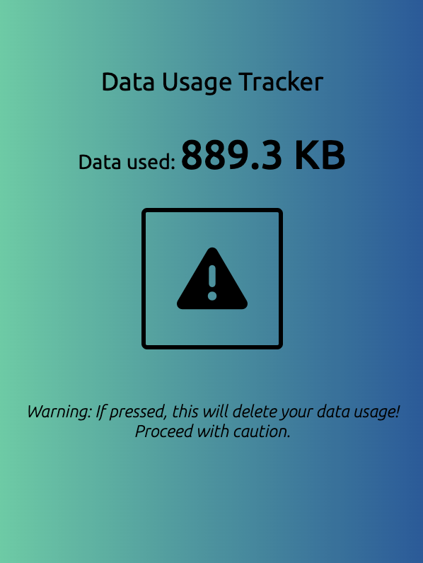

# Data Tracker Chrome Extension

Welcome! This is my chrome extension, Data Tracker. This chrome extensions provides one simple purpose. However, it's super effective, for me atleast. I want to know how much data I'm using, whether it's on personal hotspot or at home, I want to see how much this browser is using. For that reason, I have created this extension. You can download the files and unpack them to use this extension as well!

## AI Note

I used ChatGPT 4o mini for helping me debug why my background worker would not connect to background.js. This was the most annoying part so I resorted to AI for helping me. 

## Features

- Simple UI but modern looking with styled css.

- A singular button on resetting the data usage.

- Small window for quick check in.

- Refreshes every time you open extension, which saves memory.


## Instructions

- Firstly, head to ```chrome://extensions``` and enable developer mode. 

- Then download this repository, by a zip file or git clone. 

- Finally head back to ```chrome://extensions``` and click load unpacked, then select the folder of this chrome extension.

Viola! It should appear

## Preview


## Credits

Credits to the following websites for letting me use their stuff:

- https://fonts.google.com/specimen/Ubuntu

- https://icons8.com/icons/set/reset

- ChatGPT 4o mini for debugging a problem